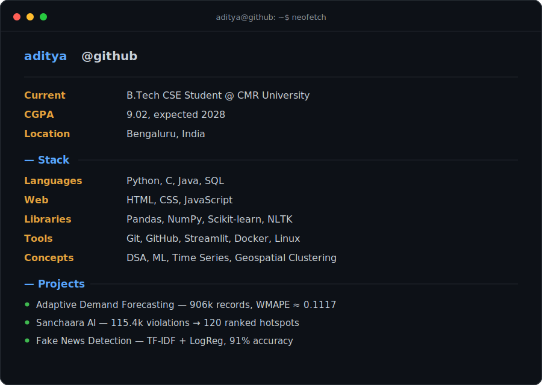
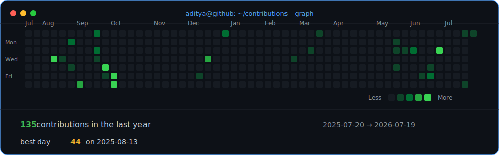

<table>
<tr>
<td valign="top"></td>
<td valign="top"></td>
</tr>
</table>

# Aditya D Nair

B.Tech CSE Student · ML/Data · Builder

## Projects

**Adaptive Demand Forecasting** — Python, Pandas, XGBoost, LightGBM
Retail demand forecasting pipeline on 906k sales records across 500 products. Engineered lag/rolling features, trained Random Forest / XGBoost / LightGBM, achieving WMAPE ≈ 0.1117.
`GitHub` · `Live Demo`

**Sanchaara AI — Traffic Enforcement Intelligence Platform** — Python, JavaScript, Streamlit, Leaflet.js, DBSCAN
Full-stack decision support system for Bengaluru Traffic Police (Flipkart Gridlock Hackathon 2.0, Round 2). DBSCAN clustering turns 115,400 parking violation records into 120 ranked enforcement hotspots, with a weighted impact-scoring model and English/Kannada localized dashboard.
`GitHub` · `Live Demo`

**Fake News Detection System** — Python, Scikit-learn, NLTK, TF-IDF
NLP classification pipeline: TF-IDF vectorization, stopword removal, stemming, Logistic Regression — 91% prediction accuracy.
`GitHub`

## Leadership

**Salesforce Agentforce Workshop — ID8NXT** — Proctored a Salesforce Agentforce workshop at Cambridge Institute of Technology, guiding participants building AI agents for workflow automation.

## Certifications

- GitHub Foundations — Credly (2024)
- Python Essentials — Cisco Networking Academy (2024)
- SQL Bootcamp — Udemy (2024)
- Deloitte Technology Job Simulation — Forage (2026)
